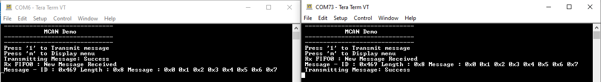

# MCAN blocking

This example shows how to use the MCAN module to transmit and receive CAN messages in polling mode.

## Description

This application transmits and receives CAN messages on the CAN bus. To run this application, two evaluation boards of same type are required. These boards acts as different nodes on the CAN bus. Same application is programmed onto both the boards. Boards are connected to PC via UART. While running the application, user can send and receive CAN messages between the boards using UART console applications running on the PC.

## Downloading and building the application

To clone or download this application from Github, go to the [main page of this repository](https://github.com/Microchip-MPLAB-Harmony/csp_apps_sam_rh71) and then click **Clone** button to clone this repository or download as zip file.
This content can also be downloaded using content manager by following these [instructions](https://github.com/Microchip-MPLAB-Harmony/contentmanager/wiki).

Path of the application within the repository is **apps/mcan/mcan_normal_operation_blocking/firmware** .

To build the application, refer to the following table and open the project using its IDE.

| Project Name      | Description                                    |
| ----------------- | ---------------------------------------------- |
| sam_rh71_ek.X | MPLABX project for SAM RH71 Evaluation Kit |
|||

## Setting up the hardware

The following table shows the target hardware for the application projects.

| Project Name| Board|
|:---------|:---------:|
| sam_rh71_ek.X | SAM RH71 Evaluation Kit
|||

### Setting up SAM RH71 Evaluation Kit

- Connect SAM RH71 Evaluation Kit to anotherSAM RH71 Evaluation Kit as per the pin connections shown below

| SAMRH71 EK - 1    | SAMRH71 EK - 2     |
| ----------------- | ------------------ |
| CANH0, J13        | CANH0, J13         |
| CANL0, J13        | CANL0, J13         |
| GND, J5           | GND, J5            |
|||

- Connect the debugger probe to J33 for each board
- Connect the Debug USB port on the board to the computer using a mini USB cable

## Running the Application

1. Open the Terminal application (Ex.:Tera term) on the computer
2. Connect to the EDBG Virtual COM port of both the boards and configure the serial settings as follows:
    - Baud : 115200
    - Data : 8 Bits
    - Parity : None
    - Stop : 1 Bit
    - Flow Control : None
3. Build and Program the application on both the boards using their respective IDEs
4. In the console associated with board 1, press "1" to transmit a CAN message
5. Transmitted message status will be displayed in the console window of board 1
6. Received message will be displayed in the console window of board 2
7. Follow the sequence below to send and receive CAN message:
    - Press '1' on board 2
8. If the steps are executed in this sequence, the final output in the consoles will be as below:

  
