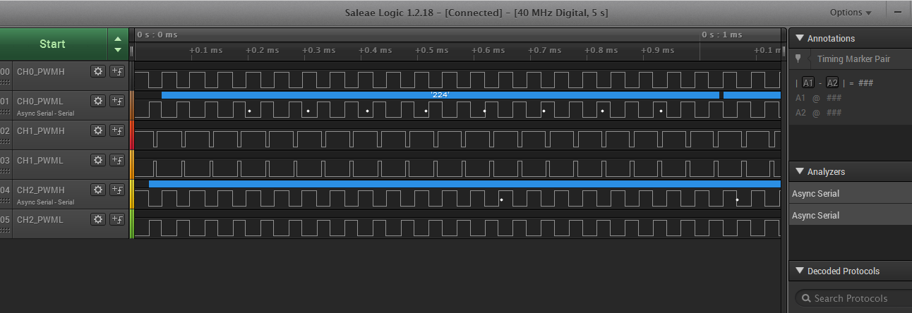

# PWM Generation

This example shows how to use the PWM peripheral to generate 3-phase PWM signals with dead time.

## Description

This example shows how to configure the PWM to generate synchronous 3-phase PWM signals with dead time (used for motor control). The duty cycle of the PWM is updated in the interrupt handler.

## Downloading and building the application

To download or clone this application from Github, go to the [top level of the repository](https://github.com/Microchip-MPLAB-Harmony/csp_apps_sam_rh71) and click

Path of the application within the repository is **apps/pwm/pwm_synchronous_channels/firmware** .

To build the application, refer to the following table and open the project using its IDE.

| Project Name      | Description                                    |
| ----------------- | ---------------------------------------------- |
| sam_rh71_ek.X | MPLABX project for SAM RH71 Evaluation Kit |
|||

## Setting up the hardware

The following table shows the target hardware for the application projects.

| Project Name| Board|
|:---------|:---------:|
| sam_rh71_ek.X | SAM RH71 Evaluation Kit
|||

### Setting up SAM RH71 Evaluation Kit

- Connect the debugger probe to J33

## Running the Application

1. Build and Program the application using their respective IDEs
2. Observe the high-side and low-side PWM waveforms on the oscilloscope
3. Observe the dead time between the high side and low side

    

Refer to the below table for PWM output pins for different boards:

| PWM Channel      | SAM RH71 Evaluation Kit |
| ---------|---------------------- |
| CH0_PWMH | PA00 (Pin 7 of J24 )  |
| CH0_PWML | PA04 (Pin 8 of J24 )  |
| CH1_PWMH | PA01 (Pin 9 of J24 )  |
| CH1_PWML | PA05 (Pin 6 of J24 )  |
| CH2_PWMH | PA02 (Pin 16 of J24)  |
| CH2_PWML | PA06 (Pin 17 of J24)  |
